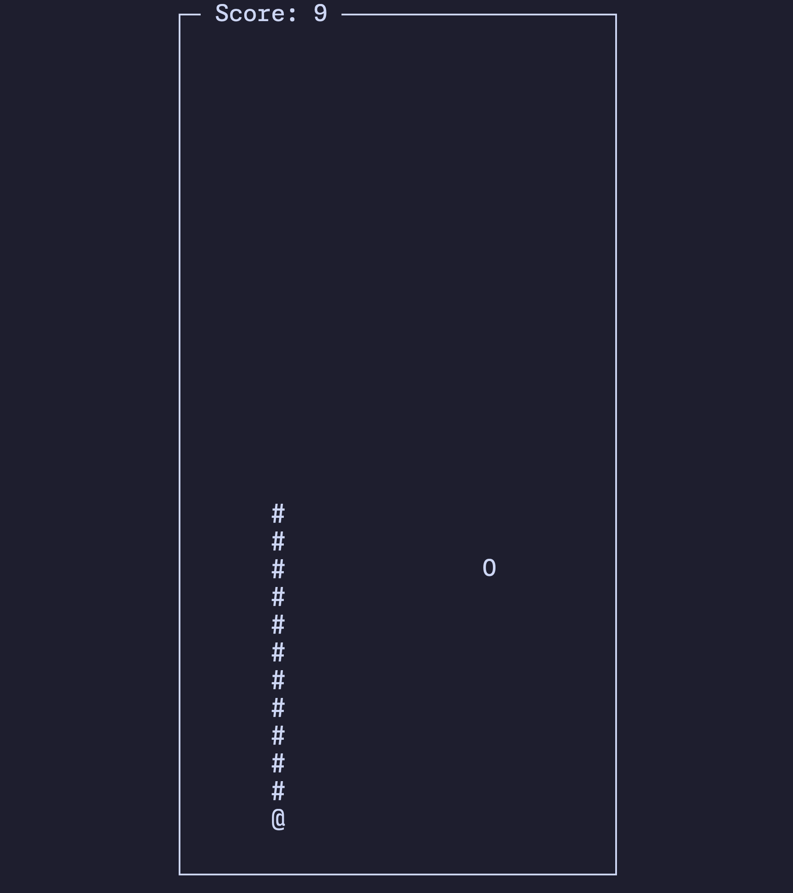
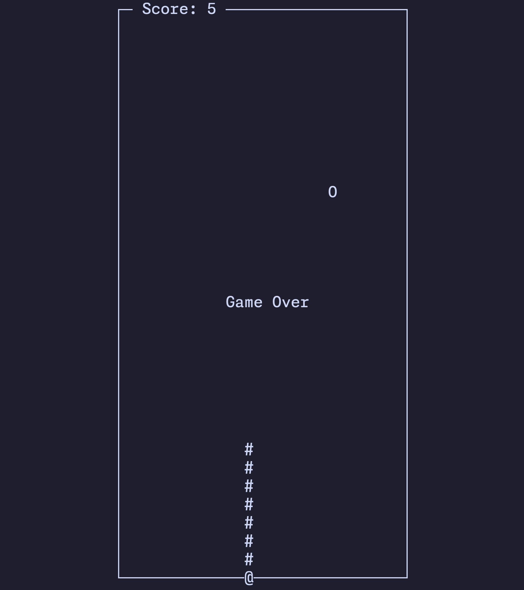

# go-snake

I built this game as part of the [Coding Challenge #57 - Snake](https://open.substack.com/pub/codingchallenges/p/coding-challenge-57-snake).

I picked Golang as I really like this language and I'm trying to improve on it.

This game was a good opportunity to explore the use of channels in Go, `chan`.

I also used the package [`tcell`](https://github.com/gdamore/tcell) to create the terminal UI aspect of the game.

It was a fun challenge and a great opportunity to learn more about this language.

## Controls

You can simply use the arrow keys to control the snake or you can also use WARS (I'm trying out Colemak at the moment).

## Screenshots

